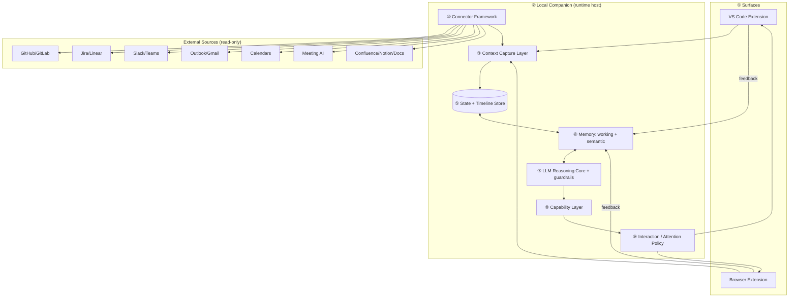
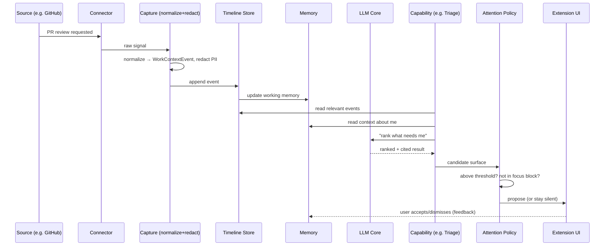

# Sidekick — Architecture Document
**A personal AI assistant for a senior engineer's working day**

| | |
|---|---|
| **Author** | Sreenath |
| **Doc type** | System architecture / design |
| **Related** | [`FEATURES.md`](./sidekick/FEATURES.md) (features + the why), the appendices (data model, privacy/security, cost & latency), and `Sidekick_Architecture.pdf` (diagrams) |

---

## Table of Contents
1. [Context & Problem Statement](#1-context--problem-statement)
2. [Goals, Non-Goals & Success Metrics](#2-goals-non-goals--success-metrics)
3. [Architectural Principles](#3-architectural-principles)
4. [System Overview](#4-system-overview)
5. [Component Architecture (part by part)](#5-component-architecture-part-by-part)
   - 5.1 Surfaces (Editor + Browser extensions)
   - 5.2 Local Companion (the runtime host)
   - 5.3 Context Capture Layer
   - 5.4 Event & Data Model
   - 5.5 State + Timeline Store
   - 5.6 Memory Subsystem
   - 5.7 LLM Reasoning Core
   - 5.8 Capability Layer (Resume / Triage / Commitments / Recall / Plan)
   - 5.9 Interaction & Attention Policy
   - 5.10 Integration / Connector Framework
6. [Data Flow (end to end)](#6-data-flow-end-to-end)
7. [Cross-Cutting Concerns](#7-cross-cutting-concerns)
   - 7.1 Privacy & Security
   - 7.2 Cost, Latency & Context Engineering
   - 7.3 Reliability & Failure Handling
   - 7.4 Observability
8. [Scalability & Evolution](#8-scalability--evolution)
9. [Trade-offs & Alternatives Considered](#9-trade-offs--alternatives-considered)
10. [Risks & Open Questions](#10-risks--open-questions)
11. [Phased Delivery Plan](#11-phased-delivery-plan)
12. [Appendix: Stress-Test Responses](#12-appendix-stress-test-responses)

---

## 1. Context & Problem Statement

### 1.1 Context
A senior engineer / tech lead spends most of their day **not writing code**. Coding itself is well-served (Copilot, Cursor). The *rest* of the day — the friction *around* the code — has no assistant. This document specifies **Sidekick**, a **broad, personal, single-user AI assistant** that addresses that whole-day friction, in the spirit of the "build software for yourself, and yourself only" movement.

### 1.2 The problem
Five recurring, daily, personally-experienced frictions:

| # | Friction | What it costs |
|---|---|---|
| P1 | **Context reconstruction** after every interruption | Minutes per interruption, many times/day |
| P2 | **Human-router overload** across Slack/Teams/Jira/PRs/email | Holding all in-flight info in your head |
| P3 | **Commitment leakage** — promises scattered across tools | Things you owe people fall through |
| P4 | **Knowledge evaporation** — you forget what you learned | Re-solving solved problems |
| P5 | **Plan-vs-reality gap** — the day's plan is wrong by 11am | Reactive triage instead of intentional work |

### 1.3 Why one assistant, not five tools
Each friction has point solutions, but they don't share *your context*. The thesis: **the value is the integration** — one assistant with a single memory of you, exposing several capabilities. That shared context is precisely what a generic, multi-tenant, single-feature product cannot have.

### 1.4 Scope boundary
- **In scope:** capturing work context, remembering state, surfacing what needs you, aiding resume/recall/planning — for one user, locally.
- **Out of scope:** code generation (solved), meeting transcription/extraction (consumed, not rebuilt), team/multi-tenant features, autonomous task execution.

---

## 2. Goals, Non-Goals & Success Metrics

### 2.1 Goals
- G1 — Capture work context across the tools I already use.
- G2 — Let me resume in seconds after an interruption.
- G3 — Surface "what needs me now" across all sources, ranked.
- G4 — Track commitments with provenance.
- G5 — Reduce knowledge re-solving via recall.
- G6 — Keep a realistic, adaptive plan that proposes (never overrides).
- G7 — Be private (local-first) and quiet (no nagging).

### 2.2 Non-Goals
- N1 — Not a code generator.
- N2 — Not a team/SaaS product.
- N3 — Not autonomous ("do my work for me").
- N4 — Not a replacement for the IDE/Slack/Jira.

### 2.3 Success metrics (single-user, anti-vanity)
| Metric | Target signal |
|---|---|
| Time-to-resume after interruption | seconds, not minutes |
| Dropped commitments | → 0 |
| Repeat-solving incidents | meaningfully down |
| Assistant interruptions/hour | within a low, user-set cap |
| Still-running-after-30-days | the real adoption test |

> Deliberately **not** "lines of code" or "tasks completed" — those reward busywork, not whether my day got better.

---

## 3. Architectural Principles

1. **Local-first.** Sensitive work context never leaves the machine without explicit consent.
2. **Shared brain, modular capabilities.** One memory/timeline; capabilities are thin consumers.
3. **Propose, don't act.** The assistant suggests; the human decides. Quiet by default.
4. **Provenance everywhere.** Every surfaced item traces to its source; nothing is asserted without a citation.
5. **Pluggable at the edges.** Sources and the LLM are connectors behind interfaces — swappable without touching the core.
6. **Graceful degradation.** Any source or the cloud model can be down; the system still works on what it has.
7. **Inspectable & reversible.** The user can see, correct, and delete anything captured or remembered.

---

## 4. System Overview



**Layered summary:**
1. **Surfaces** — thin clients where I work (capture + UI).
2. **Local Companion** — the always-on host that contains the whole brain.
3. **Capture / Model / Store / Memory / Core / Capabilities / Policy / Connectors** — detailed in §5.
4. **External sources** — read-only systems Sidekick observes via connectors.

---

## 5. Component Architecture (part by part)

### 5.1 Surfaces — Editor + Browser extensions
**Responsibility:** capture lightweight signals where I work, and render the assistant's output.
- **VS Code extension** — primary: active file, symbol, branch, PR under review, terminal focus; renders the "Resume" panel and inline nudges.
- **Browser extension (MV3)** — captures in-page context on Jira/GitHub/Docs/Mail tabs; renders a side panel.
- **Why thin:** MV3 service workers terminate after ~30s idle / 5min per request and forbid remote code — so extensions are **clients only**, never the brain.
- **Transport:** talk to the Local Companion over authenticated `localhost`.

### 5.2 Local Companion — the runtime host
**Responsibility:** the always-on process that holds capture, store, memory, core, capabilities, policy, connectors.
- Runs as a background app/menubar process; survives editor/browser restarts.
- Owns scheduling (polling/webhooks), the local DB, and all LLM calls.
- **Why it exists:** an assistant must be persistent and own its data; an extension sandbox cannot. This is the central form-factor decision (see §9).

### 5.3 Context Capture Layer
**Responsibility:** turn raw signals (from surfaces + connectors) into clean, normalized events.
- **Signal collectors** — per-source adapters emitting raw observations.
- **Normalizer** — maps everything to the canonical event model (§5.4).
- **Privacy filter** — applies the capture allowlist + PII redaction *before* anything is stored or sent to an LLM.
- **Debounce/dedup** — collapses noisy bursts (e.g. rapid file switches).

### 5.4 Event & Data Model
**Responsibility:** one canonical shape for everything, so capabilities are source-agnostic.

```
WorkContextEvent {
  id            : uuid
  ts            : timestamp
  source        : editor | github | jira | slack | teams | mail | calendar | meeting | docs | browser
  kind          : edited_file | reviewing_pr | opened_ticket | mentioned
                | message | read_doc | meeting_action | calendar_event | ...
  ref           : { url?, repo?, pr?, ticket?, thread?, file? }   // provenance
  summary       : string            // short, redacted
  project       : string | null
  confidence    : 0.0–1.0           // extraction certainty
  origin        : work | personal
}

Commitment {                        // derived entity
  id, source_event_id, direction: owed_by_me | owed_to_me,
  what, who, due?, status, confidence, provenance_ref
}

Lesson {                            // derived entity
  id, topic, insight, source_refs[], created_ts, last_surfaced_ts
}
```

### 5.5 State + Timeline Store
**Responsibility:** durable local record of events + derived entities.
- **Engine:** embedded local DB (e.g. SQLite) + a vector index for semantic retrieval.
- **Timeline:** append-only event log (enables "where was I" reconstruction).
- **Derived tables:** commitments, lessons, current-state snapshot.
- **Retention:** raw events age out; derived entities persist per policy (§5.6).

### 5.6 Memory Subsystem
**Responsibility:** the part that makes it an *assistant*, governed by explicit policies.

| Type | Holds | Lifetime |
|---|---|---|
| **Working memory** | Current task/day state ("mid-review of PR #412") | Cleared at day end |
| **Semantic memory** | Durable knowledge of me (projects, recurring lessons, who/what matters, preferences) | Persists across sessions |

**Governance policies (must be explicit):**
- **Persistence** — what's promoted from working → semantic; what's forgotten.
- **Retrieval** — recency- and task-aware; retrieve a *small relevant set*, never the whole history (avoids context rot).
- **Consistency** — preference updates are confirmed; **no silent last-write-wins**.
- **Privacy** — semantic memory encrypted at rest; redaction before any cloud call.

### 5.7 LLM Reasoning Core
**Responsibility:** the single reasoning component, behind guardrails, shared by all capabilities.
- **Model interface** — pluggable: cloud (Claude/GPT) or local model (privacy mode).
- **Guardrails** — output schemas, confidence thresholds, "cite-or-suppress" (no claim without provenance), refusal to assert low-confidence items.
- **Eval harness** — golden-set of my own past dismissals/corrections to regression-test surfacing quality.
- **Single agent + tools**, not a multi-agent swarm (cost — see §7.2).

### 5.8 Capability Layer
**Responsibility:** the five user-facing jobs; thin consumers of the shared brain.

| Capability | Input | Output | Core logic |
|---|---|---|---|
| **Resume** | Timeline before interruption | "Where you were + next steps" | State reconstruction over recent events |
| **Triage** | Open obligations across sources | Ranked "needs me now" list | Urgency × importance scoring |
| **Commitments** | Messages/meetings/tickets | Owed-by/owed-to list w/ provenance | Extraction + dedup + due tracking |
| **Recall** | Docs read / debugging events | Resurfaced lessons | Lesson capture + similarity matching |
| **Plan** | Calendar + tasks + reality | Adaptive day-shape | Propose-don't-override + energy windows |

> Capabilities **never** access sources directly — only the store/memory/core. Adding a capability does not touch ingestion.

### 5.9 Interaction & Attention Policy
**Responsibility:** decide *when and how* to reach the user. The anti-nag layer.
- **Ambient** — passive panels; no interruption.
- **Propose** — surface only above a confidence × importance threshold; one-tap accept/dismiss (dismissals train thresholds).
- **Never** — no auto-actions; no interruptions during a locked focus block; hard cap on interrupts/hour.

### 5.10 Integration / Connector Framework
**Responsibility:** uniform, pluggable access to external sources.
- **Connector interface:** `authenticate()` (OAuth) · `poll()` / `subscribe(webhook)` · `toEvents()` (normalize) · `healthCheck()`.
- Each source (§4) is one connector → emits `WorkContextEvent`s.
- **Adding a source = implementing one connector.** The core never changes (this is the extensibility guarantee).

---

## 6. Data Flow (end to end)



---

## 7. Cross-Cutting Concerns

### 7.1 Privacy & Security
- **Local-first**; data at rest encrypted; semantic memory especially.
- **Capture allowlist** — user explicitly enables each source; nothing captured silently.
- **PII redaction** before any cloud LLM call; **local-model mode** for full privacy.
- **Inspect & delete** — everything is viewable and erasable.
- **OAuth tokens** stored in the OS keychain, never in plaintext.

### 7.2 Cost, Latency & Context Engineering
- **Context rot is the real enemy, not QPS** — retrieve a small relevant working set, never dump the whole timeline.
- **Tool/context-token bloat** — lazy-load connectors; pass summarized events, not raw logs.
- **Single agent**, not multi-agent (~15× token cost avoided).
- **Latency:** capture is async/background; only surfacing is interactive (target < 2s).
- **Cost control:** quiet-by-default = fewer LLM calls; trivial items handled without a model call.

### 7.3 Reliability & Failure Handling
| Failure | Behavior |
|---|---|
| A source/API down | Degrade: plan from last-known state + "data may be stale" badge |
| Cloud LLM unreachable | Fall back to local model or queue + notify |
| Companion process crash | Auto-restart; timeline is durable (append-only) |
| Extension disconnected | Buffer signals locally, replay on reconnect |

### 7.4 Observability
- Local **event log** + per-capability surfacing metrics (precision via accept/dismiss rate).
- **Self-eval dashboard** — am I surfacing the right things? Is the interrupt cap respected?

---

## 8. Scalability & Evolution
- **Scale = context scale, not user count** (single-user by design). Handled via retrieval + summarization.
- **New source:** new connector → normalized events. Core untouched.
- **New capability:** new consumer of store/memory/core. Ingestion untouched.
- **Model upgrade / local swap:** behind the model interface; config change.
- **Future team version:** the single-user core stays; a sharing/identity layer would sit *above* it — deliberately deferred.

---

## 9. Trade-offs & Alternatives Considered

| Decision | Chosen | Alternative | Why |
|---|---|---|---|
| Form factor | Thin extensions + local companion | All-in-browser-extension | MV3 kills always-on agents; companion is persistent + private |
| Agent topology | Single agent + tools | Multi-agent swarm | ~15× token cost; single-user doesn't need it |
| Data location | Local-first | Cloud SaaS | Privacy of merged work context; single-user value |
| Autonomy | Propose-only | Auto-act | Trust; nagging/over-action kills adoption |
| Breadth | One assistant, 5 capabilities | 5 separate tools | Shared memory of *me* is the differentiator |
| Memory | Working + semantic split w/ policies | Single flat store | Cost, relevance, consistency, privacy |

---

## 10. Risks & Open Questions
- **R1 — Capture scope tightrope.** Too little = useless; too much = creepy. *Mitigation:* start narrowest (editor + PRs), widen as trust is earned.
- **R2 — "Recall" is the least proven capability.** Distinguishing a durable lesson from noise is hard. *Mitigation:* manual "save lesson" first; automate later.
- **R3 — Surfacing relevance will misfire early.** *Mitigation:* feedback loop + eval set of my own dismissals.
- **R4 — Adoption.** Will I keep it running? *Mitigation:* ship the single highest-value capability (Resume) alone first; expand only if it sticks.
- **Open:** realistic local-model quality/cost for the reasoning tasks; exact thresholds for "propose vs stay silent."

---

## 11. Phased Delivery Plan
| Phase | Integrations | Capabilities | Goal |
|---|---|---|---|
| **1 — MVP** | VS Code + GitHub | Resume | Prove the single highest-value job earns daily use |
| **2** | + Slack/Teams + Jira | + Triage + Commitments | Prove cross-tool surfacing |
| **3** | + Calendar + Meeting AI + Docs | + Plan + Recall | Full broad assistant |

---

## 12. Appendix: Stress-Test Responses
- **"Client adds a requirement / new tool"** → implement one new **Connector** that normalizes into `WorkContextEvent`. Core, memory, capabilities, policy untouched. The connector seam exists for exactly this.
- **"Budget cut in half"** → keep the **shared core + Resume** (Phase 1). Defer Triage/Commitments/Recall/Plan; cut browser capture + cloud model. Cut *capabilities, not the foundation*.
- **"Isn't this a GPT wrapper?"** → No — it's a capture pipeline + memory governance + five capabilities over a shared timeline + an attention policy. The LLM is one guarded, swappable component.
- **"Why hasn't a big company built this?"** → The value is being *single-user, personal, local-first* — it learns *me*. A multi-tenant product won't optimize for one person; that's the "build for yourself" point.
- **"Isn't broad = unfocused?"** → The breadth is unified by one shared memory of me — that's the differentiator. Broad in vision, focused in delivery (one capability ships at a time).
```
