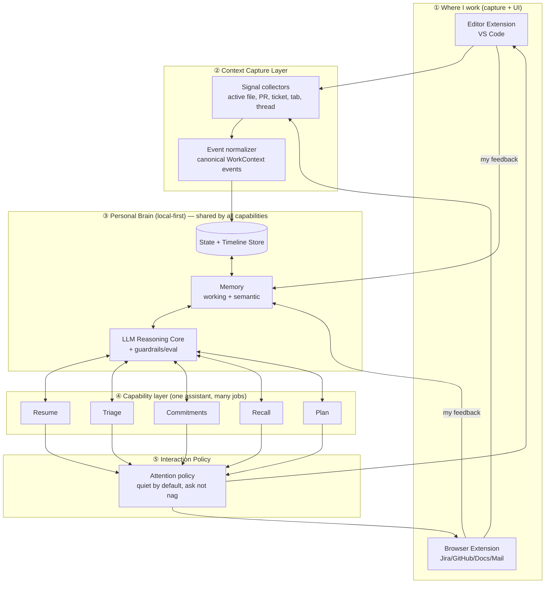

# Sidekick — Architecture & Design Document
### A *broad* personal AI assistant for a senior engineer's whole working life — combining many daily frictions into one assistant, delivered where I work (editor + browser extension + local companion)

> **Hiring challenge — Tech Lead track**
> Author: Sreenath · Date: 2026-06-28
> Deliverable: architecture/design doc (problem → system → trade-offs → scale → what's broken)
>
> **Framing note (important):** This is deliberately a *broad, integrative personal assistant*, not a single-feature tool. The value is in **combining** many small daily frictions under one assistant that knows my whole working context — in the spirit of the "build software for yourself, and yourself only" movement. The individual frictions below are **capabilities/modules** of one assistant, not separate products.

---

## 0. TL;DR

I'm a senior engineer / tech lead. My *coding* has tools (Copilot, Cursor). But the **rest of my whole working day** — the part that actually drains me — has no assistant at all. It's death by a thousand small frictions:
- reconstructing context after every interruption ("where was I?"),
- being a human router across Slack/Teams/Jira/PRs/email,
- losing the thread of *what I committed to* across ten tools,
- forgetting what I learned an hour after I learned it,
- and a daily plan that's wrong by 11am.

There's a movement (the Paras Chopra *"what have you built for yourself, and yourself only?"* thread) of engineers building **personal AI tools** to fix exactly this — because no product does it *for them specifically*, and because the real win is **one assistant that combines all of it**, not ten disconnected apps.

**Sidekick** is my version: a **broad personal AI assistant** for my working life — shipped as an **editor + browser extension backed by a local companion process** — that sits beside my whole day and removes the friction *around* the code. It is one assistant with several capabilities (resume, triage, commitments, recall, planning) sharing one memory of *me*.

It is deliberately a **system, not a script**: a context-capture layer across my tools, a shared personal memory/state store, an LLM reasoning core with guardrails, a capability layer, and an extension UI surface — each with real trade-offs I can defend. The breadth is the point; the shared memory is what makes it an *assistant* and not a pile of features.

---

## 1. The Problem

### 1.1 The friction (personally experienced, every day)
The hardest part of a senior engineer's day isn't writing code — it's everything *around* it:

- **Context reconstruction.** Every interruption (a meeting, a ping, an incident) wipes my mental state. Getting back to "where was I?" costs real minutes, many times a day.
- **Human-router load.** I'm the person everyone @-mentions. Information flows *through* me across Slack, Teams, email, Jira, GitHub — and I hold it all in my head.
- **Commitment leakage.** What I actually owe people is scattered: a "can you look by Friday?" in a thread, a review request, a Jira ticket, a promise in a meeting. No single place knows my real obligations.
- **Knowledge evaporation.** I read a doc, debug a tricky thing, learn a pattern — and forget it within weeks. I solve the same problem twice.

None of this is "write code faster." It's "make the *day* around the code less exhausting." That's the gap — and it's why engineers are hand-building personal tools for it.

### 1.2 Why "for myself only" is the right framing (and good scoping)
The Paras Chopra genre is a real signal: the best version of this tool is **single-user and personal**, because the value *is* the personalization — it learns *my* tools, *my* patterns, *my* blind spots. This also scopes the system cleanly:
- **In scope:** capturing my work context, remembering my state, surfacing what needs me, helping me resume and recall.
- **Out of scope (deliberate):** multi-tenant SaaS, team features, replacing Slack/Jira/the IDE, and "do the work for me" autonomy. Sidekick *assists*; I act.

### 1.3 What I'm NOT reinventing (honesty up front)
Research (multiple fact-checked passes) told me where the gaps are and aren't:
- ✅ In-editor code generation — solved (Copilot/Cursor). *I don't touch this.*
- ✅ Meeting transcription / action-item extraction — solved (Granola/Otter/Copilot recaps). *I consume it.*
- ❌ **The unsolved wedge:** a *personal*, cross-tool layer that captures my work context, remembers it across interruptions, and surfaces "what needs *me* right now + where was I + what did I learn" — tuned to me, living *in* the tools I already use (editor + browser). Nobody ships this for the individual.

---

## 2. Goals & Non-Goals

| Goals | Non-Goals |
|---|---|
| Capture my work context across editor + browser tools | Replace IDE / Slack / Jira |
| Remember my state so I can resume after interruptions | Be a team product or multi-tenant SaaS |
| Surface "what needs me now" across sources | Generate code (Copilot already does) |
| Help me recall what I've learned (anti-evaporation) | Auto-execute tasks autonomously |
| Live where I work (extension), low friction | Boil-the-ocean "AI runs my life" |
| Personal, private, learns *me* | Rebuild transcription/extraction |

**Success metric (for me, the only user):** *After an interruption, did I get back to flow in seconds instead of minutes? Did nothing important fall through? Did I stop re-solving the same problem?* (Not "lines of code" — a deliberately anti-vanity metric.)

---

## 3. High-Level Architecture



## 3A. Full Feature List

### 🧭 Resume — "where was I?"
- Continuous **context snapshot** (active file, PR, ticket, open tabs, branch)
- **One-click resume** after an interruption: "here's where you left off + your next 3 steps"
- **Interruption log** (what pulled you away, when)
- **"Pick up yesterday"** morning catch-up

### 📥 Triage — "what needs me now?"
- **Unified inbox** of @-mentions, review requests, DMs, assigned tickets across all tools
- **Urgency × importance scoring** (Eisenhower-style ranking)
- **Never-miss flag** so genuinely urgent items aren't buried
- **Batch mode** — group non-urgent items into one pass instead of constant interruptions

### ✅ Commitments — "what did I promise?"
- **Auto-captured commitments** pulled from threads/meetings/tickets ("can you look by Friday?")
- **Provenance link** back to the source message for every item
- **Owed-by-me / owed-to-me** views
- **Gentle nudges** before a promise slips

### 🧠 Recall — "what did I learn?"
- **Auto-lesson capture** from docs read / problems debugged
- **Smart resurfacing** when you hit a related problem ("you solved this in March")
- **Ask-your-own-memory** ("what did I learn about X?")
- **Anti-re-solving** alert when about to redo solved work

### 🗓️ Plan — "what's realistic today?"
- **Adaptive day-shape** that adjusts as reality shifts
- **Propose-don't-override** (suggests, never silently reshuffles)
- **Energy-aware** protection of your deep-work window
- **Focus shield** (quiet during locked focus blocks)

### ⚙️ Cross-cutting (all capabilities)
- **Quiet-by-default attention policy** (ambient → propose → never nag)
- **Learns you** from feedback/dismissals
- **Local-first & private** — data stays on your machine; redaction before any cloud call
- **Everything inspectable** — view/clear what was captured
- **Conversational** — ask the assistant anything across your whole work context

---

## 3B. Integrations

### Surfaces (where it lives)
- **VS Code extension** — primary capture + UI
- **Browser extension** (Chrome/Edge) — in-page capture for Jira/GitHub/Docs/Mail
- **Local companion process** — holds the brain

### Source integrations (read-only)
| Category | Tools |
|---|---|
| Code | GitHub / GitLab (PRs, reviews, mentions) + the editor |
| Tickets | Jira (+ Linear) |
| Chat | Slack, Microsoft Teams |
| Email | Outlook, Gmail |
| Calendar | Outlook Calendar, Google Calendar |
| Meetings | Granola / Otter / Copilot recaps (consumes action-items, doesn't rebuild) |
| Docs | Confluence, Notion, Google Docs |

### LLM integration
- **Pluggable model** behind an interface — cloud (Claude/GPT) or local (privacy mode); config swap

### Integration phasing (also the "budget-cut" answer)
- **Phase 1 (MVP):** VS Code + GitHub → **Resume** only
- **Phase 2:** + Slack/Teams + Jira → **Triage + Commitments**
- **Phase 3:** + calendar/meetings/docs → **Plan + Recall**

> **Principle:** every integration is a **pluggable connector** normalizing into one event model. Adding a tool = one new connector; the brain never changes. *(This is the "client adds a requirement" stress-test answer.)*

---

### The capabilities (this is the BROAD part — one assistant, many jobs)
Sidekick is one assistant that combines these capabilities, all sharing the same memory of me:

| Capability | The friction it removes | What it does |
|---|---|---|
| 🧭 **Resume** ("where was I?") | Context reconstruction after interruptions | Rebuilds my pre-interruption state so I get back to flow in seconds |
| 📥 **Triage** ("what needs me now?") | Human-router overload across tools | Ranks real obligations across Slack/Jira/PRs/email by urgency × importance |
| ✅ **Commitments** ("what did I promise?") | Commitment leakage across ten tools | Tracks what I owe people, surfaced from threads/meetings/tickets, with provenance |
| 🧠 **Recall** ("what did I learn?") | Knowledge evaporation | Captures durable lessons from what I read/debugged; resurfaces them when relevant |
| 🗓️ **Plan** ("what's realistic today?") | Plan-vs-reality gap | Keeps a realistic day-shape that adapts as reality shifts — proposes, never overrides |

> The breadth is deliberate and defensible: these are **not five products**, they're five lenses on **one shared timeline + one memory of me**. That shared context is exactly what a generic single-feature tool can't have — and why "build it for myself" wins.

### The four layers in plain language
1. **Where I work (surfaces).** Two thin extensions — one in my editor, one in my browser — that both *capture context* and *show me things*. This is the "extension" form factor you asked for, used where it's actually strong (UI + light capture), not as the brain.
2. **Context Capture Layer.** Lightweight collectors note what I'm doing (active file, the PR I'm reviewing, the Jira ticket open, the thread I'm in) and normalize it into canonical "WorkContext" events.
3. **Personal Brain (local-first).** The real system: a timeline/state store, a memory subsystem (working vs. semantic), an LLM reasoning core with guardrails, and a **surfacing engine** that answers the three questions that kill my day — *what needs me, where was I, what did I learn.*
4. **Interaction Policy.** Quiet by default. It *proposes*, never nags. This is a deliberate trust decision.

---

## 4. Deep dive: what makes this a SYSTEM (not a wrapper)

### 4.1 The "WorkContext" timeline + the three surfacing jobs
Every signal normalizes into one event shape (with **provenance** always):
```
WorkContextEvent {
  id, ts, source(editor|github|jira|slack|browser|mail)
  kind: edited_file | reviewing_pr | opened_ticket | mentioned | read_doc | ...
  ref, summary, project, confidence
}
```
The **surfacing engine** turns this timeline into three answers:
- **"Where was I?"** — reconstructs my pre-interruption state so I resume in seconds (kill context-reconstruction cost).
- **"What needs me now?"** — ranks real obligations across tools by urgency × importance (kill human-router load + commitment leakage).
- **"What did I learn?"** — captures durable lessons from what I read/debugged and resurfaces them when relevant (kill knowledge evaporation).

> This is entity-resolution + ranking + recall over a personal event stream — architecture, not a prompt.

### 4.2 Memory subsystem (the richest trade-off)
| Memory | Holds | Lifetime |
|---|---|---|
| **Working** | Current task/day state ("mid-review of PR #412") | Cleared at day end |
| **Semantic** | Durable knowledge about *me* (my projects, my recurring lessons, who/what matters) | Persists |

Four governance policies I must defend: **persistence** (what's kept vs forgotten), **retrieval** (recency/task-aware, to avoid context-rot), **consistency** (preference updates confirmed, not silent-overwritten), **privacy** (semantic memory is sensitive → encrypted, local-first).

### 4.3 The Attention Policy (quiet-by-default)
The failure mode of every assistant is *nagging*. So Sidekick is graduated:
- **Ambient** — passive "where was I" panel, no interruption, there when I look.
- **Propose** — surfaces "this needs you" only above a confidence + importance threshold; one-tap dismiss teaches it.
- **Never** — never auto-acts, never pings during a locked focus block.

---

## 5. Form-factor decision (extension — but architected honestly)

You asked for an extension. Here's how to do it *well*, because the naive version breaks:

| Concern | Reality | Decision |
|---|---|---|
| Browser extension (MV3) | Service worker dies after 30s idle / 5min per request; no remote code | Extension is a **thin capture + UI client only** |
| Editor extension (VS Code) | Long-lived host, good API, lives where I code | Primary capture + UI surface |
| The "brain" | Needs to persist, run the LLM, hold memory | A **local companion process** (local-first), extensions talk to it over localhost |

**Decision:** ship **two thin extensions (editor + browser) backed by a local companion process** that holds the brain. This gives you the extension form factor you want *and* survives MV3's limits — and the "why a companion process, not all-in-the-extension?" reasoning is itself a strong Tech Lead trade-off to present.

---

## 6. Scale, cost, latency (single-user, defended)
- **Context-rot, not QPS, is the enemy** — never dump the whole timeline into a prompt; retrieve only relevant recent events.
- **Tool/context-token bloat is real** (a single tool integration can cost tens of thousands of tokens upfront) → lazy loading + summarized timeline, not raw logs.
- **No multi-agent swarm** (≈15× token cost) — one reasoning agent with tools.
- **Latency:** capture is async/background; only surfacing is interactive (target <2s over a small working set).
- **Cost control:** "quiet by default" doubles as cost control — fewer surfaces = fewer LLM calls.

---

## 7. Failure modes & mitigations (Self-Awareness)

| Failure | Impact | Mitigation |
|---|---|---|
| Hallucinated "you committed to X" | Trust-killing | Provenance + confidence; low-confidence is shown, not asserted |
| Missed something urgent | Bad | Conservative urgency; ambiguous → surfaced not suppressed |
| Nagging / over-surfacing | I disable it | Graduated quiet-by-default policy; feedback teaches thresholds |
| Privacy leak (work data → cloud LLM) | Serious | Local-first; redaction before any cloud call; local-model option |
| Capture is creepy/too broad | I distrust it | Explicit allowlist of sources; everything inspectable; nothing leaves the machine without consent |

---

## 8. Evolution / Extensibility
- **New tool to capture?** New signal collector → normalize to WorkContextEvent. Brain unchanged. *(This is my "client adds a requirement" answer.)*
- **Local vs cloud LLM?** Behind an interface; config swap.
- **Team version later?** Single-user core stays; sharing is a layer above — deferred.

---

## 9. What's broken / what I'd do with more time (honest)
- **Capture scope is the privacy/trust tightrope** — too little and it's useless, too much and it's creepy. I'd start with the *narrowest* useful capture (editor + PRs only) and earn trust before widening.
- **"What did I learn" is the hardest and least proven** — distinguishing a durable lesson from noise is genuinely hard; might cut to manual "save this lesson" first.
- **Surfacing relevance will misfire early** — needs a real feedback loop and an eval set of my own dismissals.
- **The deepest unknown:** will *I* actually keep it running, or will it become another abandoned tool? I'd test the single highest-value job ("where was I?") alone, cheaply, before building the rest.

---

## 10. Stress-test answers (for the live discussion)
- **"Client adds a requirement / new tool"** → new signal collector normalizing into the existing WorkContext model; brain/memory/policy untouched. That seam is *why* I designed it this way.
- **"Budget cut in half"** → the broad assistant degrades *gracefully by capability*, because they share one brain. I keep the shared core (capture + memory + reasoning) and the single highest-value capability — **Resume** ("where was I?") in the editor. I defer Triage, Commitments, Recall, and Plan, and cut browser capture + the cloud-model option. The assistant still exists and is useful on day one; the breadth phases in. *(This is the advantage of the broad-but-shared-core design: I cut capabilities, not the foundation.)*
- **"Isn't this a GPT wrapper?"** → No — it's a personal context-capture pipeline + memory governance + surfacing/ranking + an attention policy. The LLM is one guarded component.
- **"Why hasn't a big company built this?"** → Because the value is in being *single-user and personal* (learns me, my tools, local-first privacy) — exactly what a multi-tenant product won't optimize for. That's the whole point of the "build for yourself" genre.

---

*Research basis: multiple fact-checked deep-research passes (200+ research agents, 3-vote verification) on the senior-engineer daily-friction map, the Paras-Chopra "build-for-yourself" movement, agent memory governance, MV3 extension limits, and context/cost engineering.*
