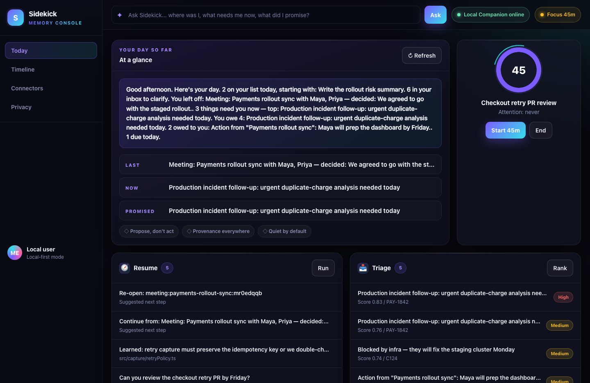
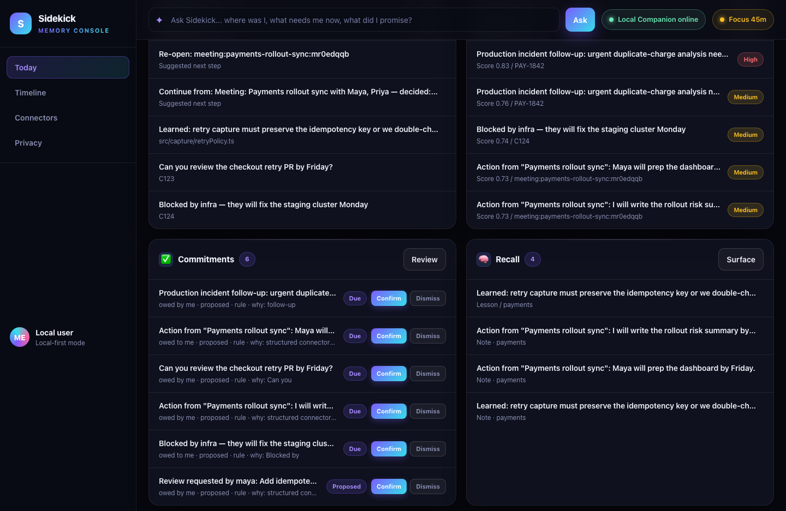
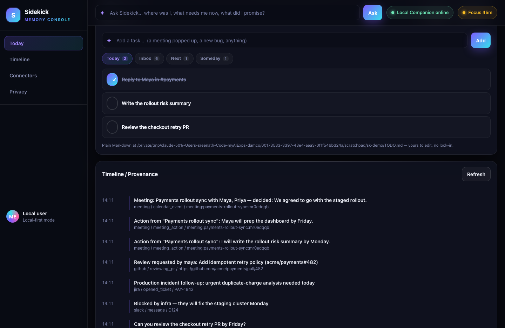
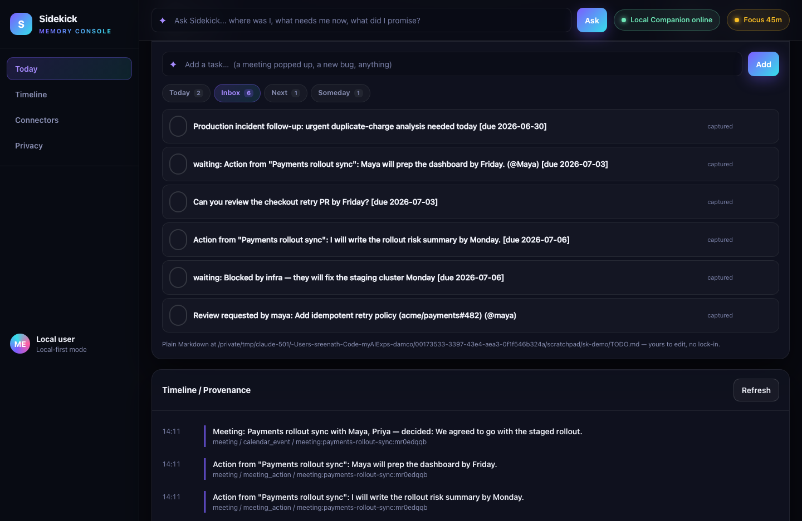
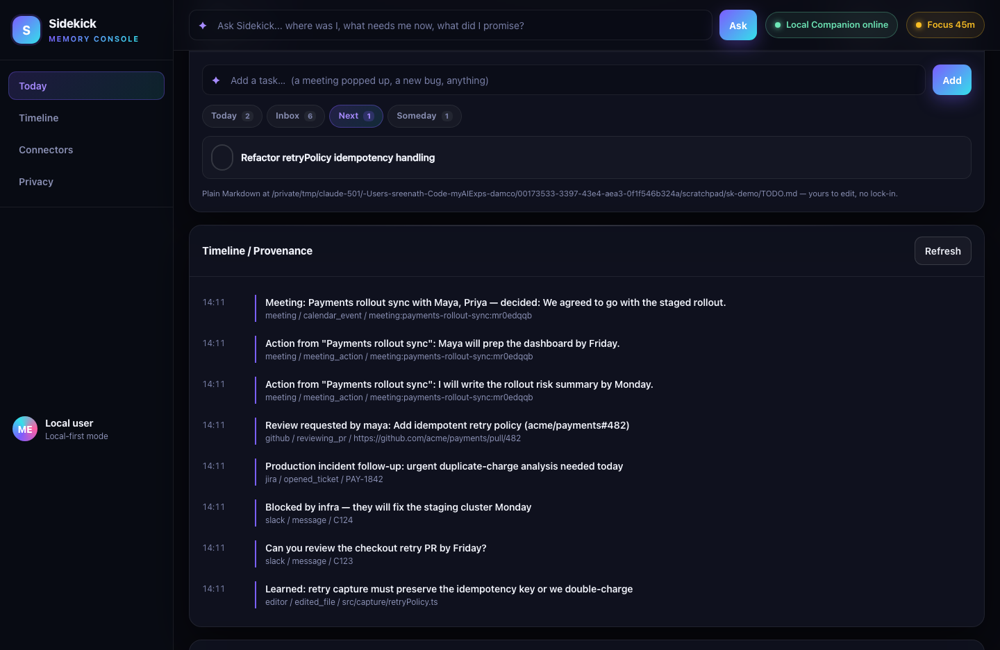
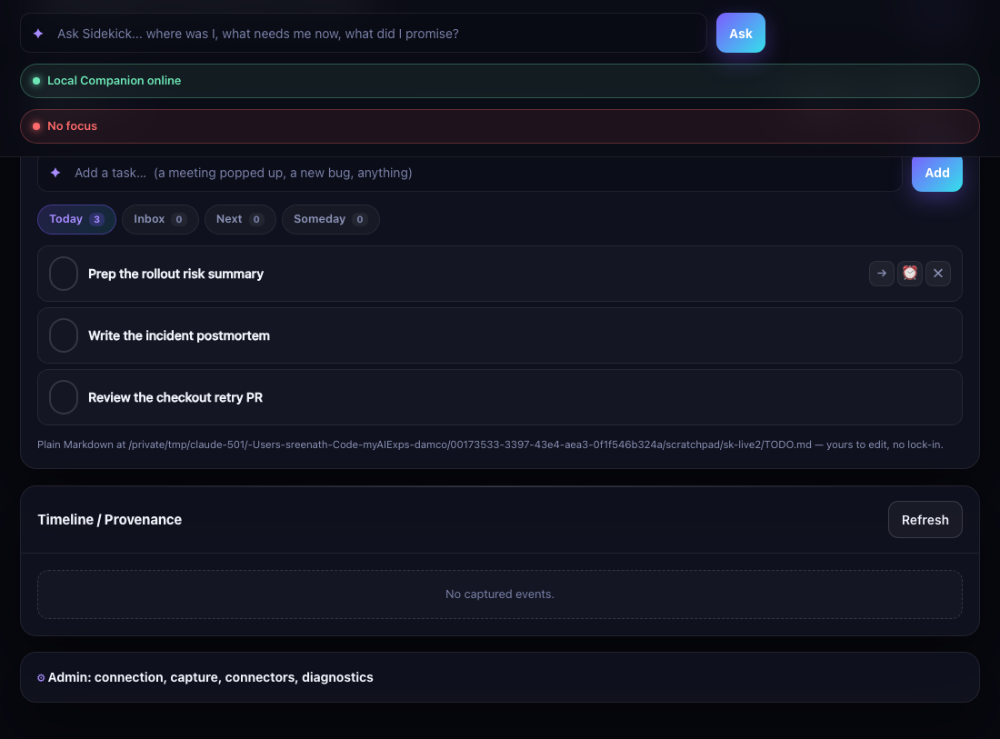
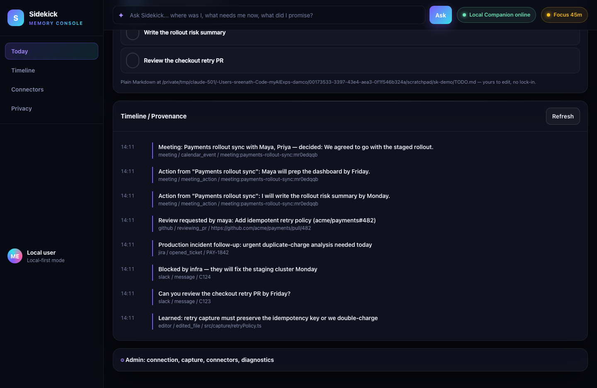
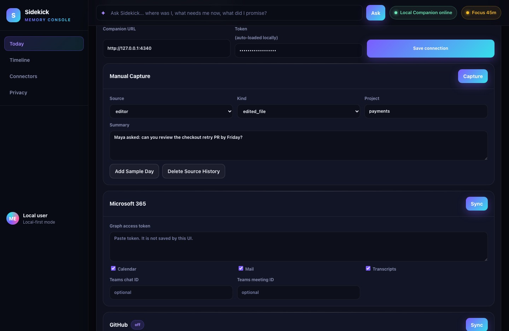
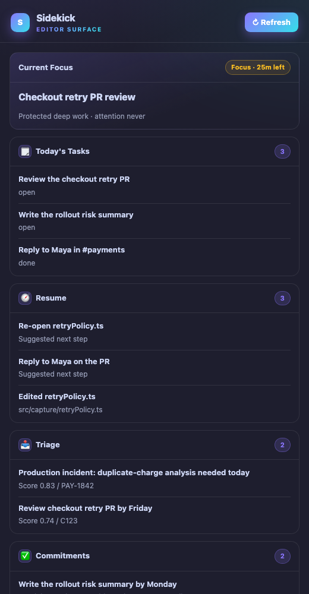
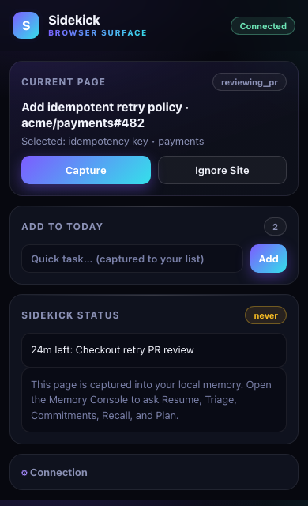

# Sidekick — Demo Storyboard

A walkthrough of the full product across all three interfaces, captured **live** from the running companion with real seeded data (not mockups). Screenshots are in [`demo-shots/`](./demo-shots/). Use this as a video script — each shot has a caption and a one-line talking point.

> Scenario seeded for the demo: a payments engineer mid-day — editing `retryPolicy.ts`, a Slack PR-review request, a production incident ticket, a GitHub review request, and a "Payments rollout sync" meeting whose action items became tracked commitments. A 45-minute Focus Session is running.

---

## Interface 1 — Memory Console (the home)

### 1. Overview — Briefing + recap + live focus

- **Companion online**, a **Focus 45m** session running (note the animated ring at "45").
- The **Briefing** speaks like an assistant: *"Good afternoon. 2 on your list today… 6 in your inbox to clarify. You left off: the rollout sync meeting… 3 things need you now… You owe 4… 2 owed to you."*
- **At a glance:** Last / Now / Promised — each clickable to its panel.
- Below: **Resume** and **Triage** already populated with ranked, provenance-backed items.

### 2. The five capabilities — the shared brain, working

- **Commitments (6)** — each shows direction (*owed by me / owed to me*), the engine (*rule*), **and why it fired** ("why: Can you", "why: Blocked by") — full inspectability — with inline **Confirm / Dismiss**.
- The GitHub PR review and the meeting's action items are all here as tracked commitments.
- **Recall (4)** surfaces the lesson *"retry capture must preserve the idempotency key"* with provenance.
- **Talking point:** one capture stream → five capabilities → no double-entry. A single-feature tool can't do this.

### 3. Tasks — Today (Things-grade board over plain Markdown)

- Segmented **Today / Inbox / Next / Someday** tabs with live counts; round checkboxes; a done item with the gradient checkmark + strikethrough.
- Footer: *"Plain Markdown at ~/.sidekick/TODO.md — yours to edit, no lock-in."*

### 4. Tasks — Inbox (GTD Capture)

- Everything Sidekick captured lands in the **Inbox** to clarify: the incident `[due 2026-06-30]`, *"waiting: Maya will prep the dashboard (@Maya)"*, the GitHub PR review — with smart due-date + owner extraction.
- **Talking point:** Sidekick is your GTD *Capture* step; you do the *Clarify*.

### 5. Tasks — Next Actions

- Your deferred/clarified work, separate from Today.

### 6. Hover quick-actions (move / reschedule / delete)

- On hover, each row reveals **→ move · ⏰ reschedule · ✕ delete** — Things-style, but it's still just a Markdown file underneath.

### 7. Timeline / Provenance

- Every surfaced item traces back to a real event (meeting / Slack / ticket / file) with its provenance ref. **Inspectable & reversible.**

### 8. Admin — connectors, capture, privacy

- Token **auto-loaded locally** (no paste). **Manual Capture**, **Microsoft 365** connector (Calendar/Mail/Transcripts), **GitHub** connector, **Delete Source History** (cascades to derived records).

---

## Interface 2 — VS Code Editor Extension

### 9. The editor panel — capabilities where you live

- Theme-aware glass UI. **Current Focus** with the live timer, **Today's Tasks (3)**, **Resume**, **Triage** (scores + provenance), **Commitments** — all without leaving the editor.
- Ambient capture (`opened_file` / `edited_file`) runs silently; quick-add via *"Sidekick: Add to Today's List"*.

---

## Interface 3 — Chrome / Edge Browser Extension

### 10. The capture popup

- **Connected** status. **Current Page** detects a real PR (`reviewing_pr`, `acme/payments#482`). One-click **Capture**. **Add to Today** quick-task. Live **Focus** status. A thin capture surface — the brain lives in the companion.

---

## The throughline (the close)
One private, local, encrypted memory of your work → five capabilities, a meeting lifecycle, a GTD task board, three thin surfaces. Everything is **propose-don't-act**, **provenance-backed**, and **yours** (the task list is a Markdown file you can open in any editor). That shared, inspectable, local memory is what a generic single-feature tool structurally can't match.

> **Note on format:** these are sequential screenshots, not a video file (this environment can't encode screen video). They're ordered as a shot list — read top to bottom as your recording script.
